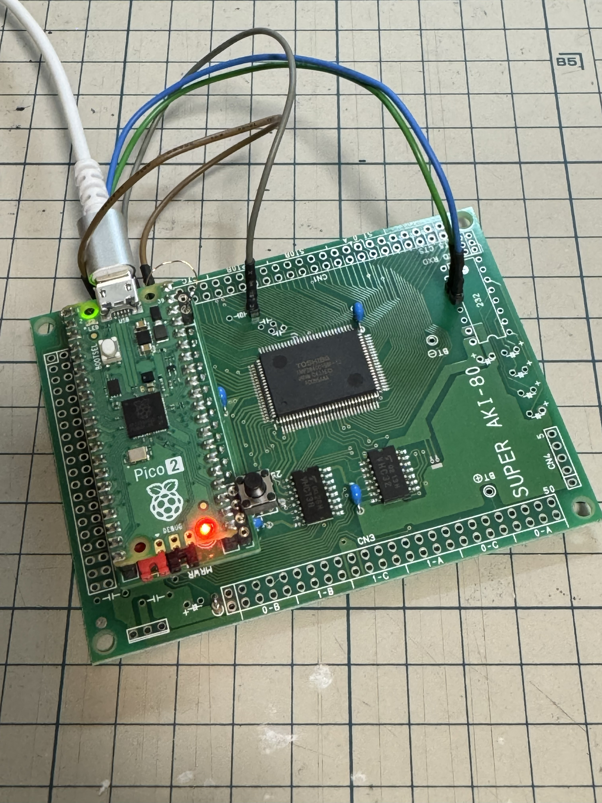
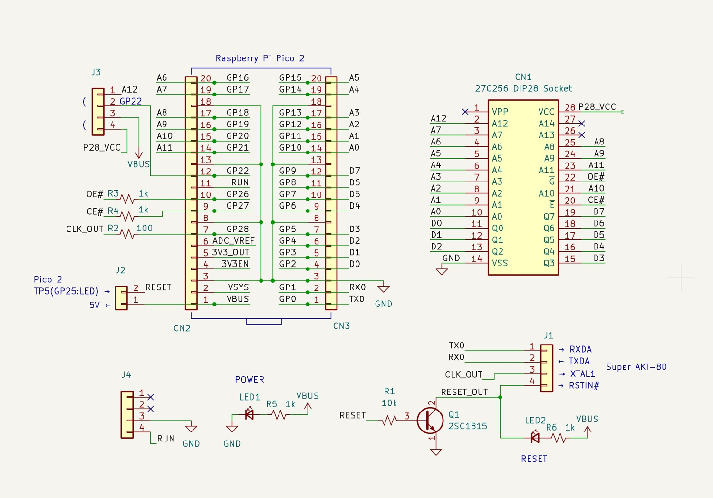

# Pico2ROMEmu\_PCB

Pico2ROMEmu PCB
This is a KiCad project for a Pico2ROMEmu ROM emulator.  
For more information, please see [Pico2ROMEmu](https://github.com/kyo-ta04/Pico2ROMEmuBR).  
- KiCad Version: 9.0.5  
- License: MIT  
- Includes: Schematic, PCB layout, BOM, Gerber files  

KiCanvas view ->
[schematics](https://kicanvas.org/?github=https%3A%2F%2Fgithub.com%2Fkyo-ta04%2FPico2ROMEmu_PCB%2Fblob%2Fmaster%2FPico2ROMEmu_PCB.kicad_sch), 
[board](https://kicanvas.org/?github=https%3A%2F%2Fgithub.com%2Fkyo-ta04%2FPico2ROMEmu_PCB%2Fblob%2Fmaster%2FPico2ROMEmu_PCB.kicad_pcb)

## Disclaimer
This software is provided as is. The author is not responsible for any damage.
