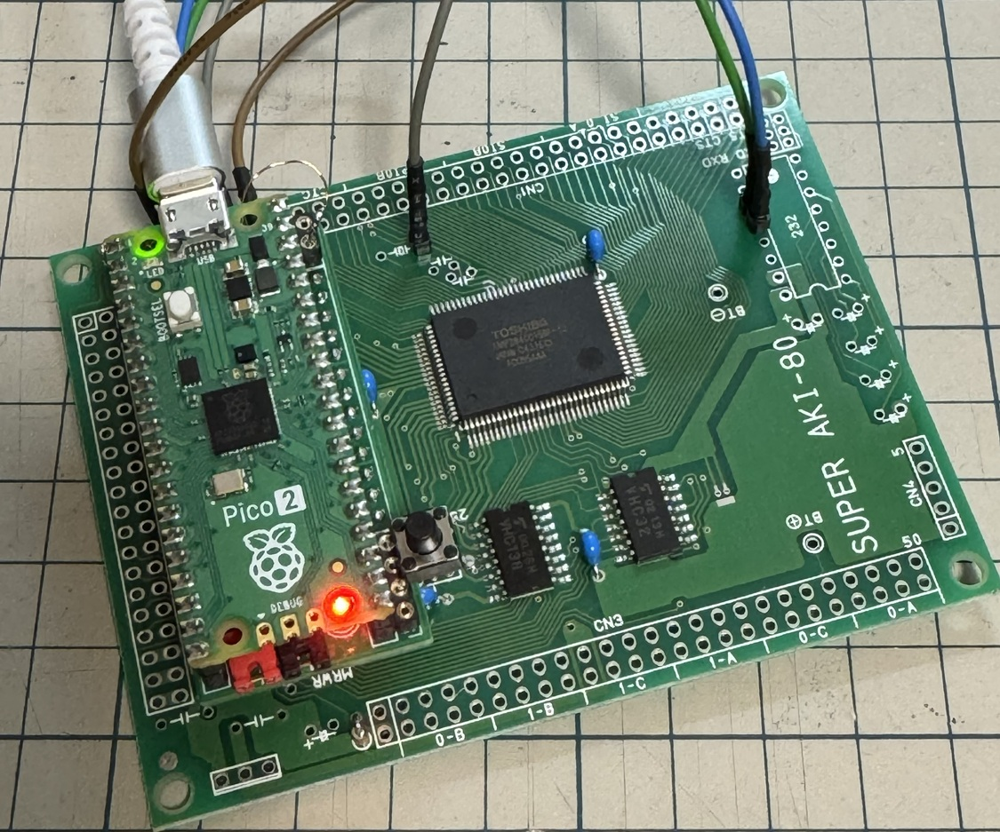

# Pico2ROMEmu\_PCB

Pico2ROMEmu PCB
This is a KiCad project for a Pico2ROMEmu ROM emulator.  
For more information, please see [Pico2ROMEmu](https://github.com/kyo-ta04/Pico2ROMEmuBR).  
- KiCad Version: 9.0.5  
- License: MIT  
- Includes: Schematic, PCB layout, BOM, Gerber files  

KiCanvas view ->
[schematics](https://kicanvas.org/?github=https%3A%2F%2Fgithub.com%2Fkyo-ta04%2FPico2ROMEmu_PCB%2Fblob%2Fmaster%2FPico2ROMEmu_PCB.kicad_sch), 
[board](https://kicanvas.org/?github=https%3A%2F%2Fgithub.com%2Fkyo-ta04%2FPico2ROMEmu_PCB%2Fblob%2Fmaster%2FPico2ROMEmu_PCB.kicad_pcb)  

Gerber file -> [Pico2ROMEmu_PCB_0.1.zip](https://github.com/kyo-ta04/Pico2ROMEmu_PCB/blob/master/production/Pico2ROMEmu_PCB_0.1.zip)

## Schematics and Documents
- Assembly instructions (note.com)
  - [Pico2ROMEmuの組み立て方](https://note.com/quiet_duck4046/n/n425d6b7e8d55?sub_rt=share_sb)
  - [Super AKI-80の組み立て方(最少部品編)](https://note.com/quiet_duck4046/n/n32906e1dfb96?sub_rt=share_sb)  
- 
- 

## Disclaimer
This software is provided as is. The author is not responsible for any damage.
